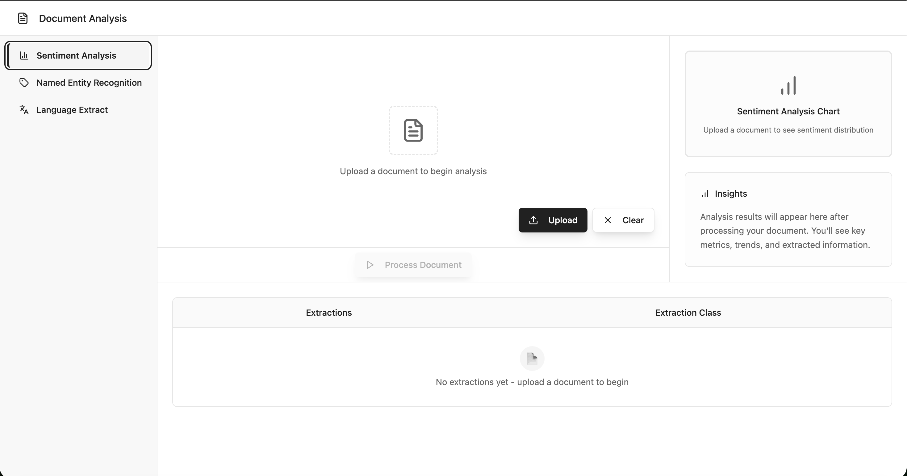
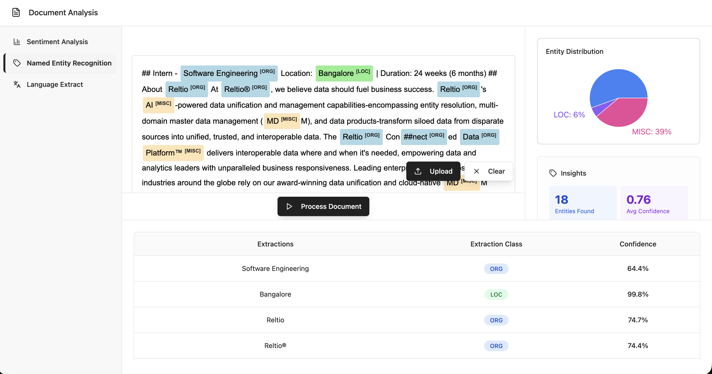

# FinSight - Financial Document Analysis

🚀 **Developed as part of the Infosys Springboard Virtual Internship program.**

FinSight is a comprehensive financial document analysis platform leveraging state-of-the-art NLP models (like FinBERT for sentiment analysis and BERT for Named Entity Recognition) alongside robust document conversion techniques to analyze and extract data from financial reports in real-time.

---

## 📸 Screenshots

| Dashboard & Upload | Named Entity Recognition (NER) |
| :---: | :---: |
|  |  |

---

## Prerequisites

- Python 3.10+
- Node.js 16+
- Git
- uv (Python package manager)

## Setup

**1. Clone the repository:**
```bash
git clone https://github.com/amalsalilan/Infosys-Springboard-Internship-FinanceInsight.git
cd Infosys-Springboard-Internship-FinanceInsight
```

**2. Install uv (if not already installed):**
```bash
# Windows
powershell -c "irm https://astral.sh/uv/install.ps1 | iex"

# macOS/Linux
curl -LsSf https://astral.sh/uv/install.sh | sh
```

**3. Install Python dependencies (from the root directory):**
```bash
uv sync

# On Windows, also install libmagic for langextract service:
uv pip install python-magic-bin
```

**4. Install Node dependencies (inside the frontend directory):**
```bash
cd frontend
npm install
cd ..
```

## Running the Application

**1. Start backend services:**
```bash
uv run python scripts/start_backend.py
```

**2. Start frontend (in a new terminal):**
```bash
cd frontend
npm run dev
```

**3. Access the application:**
Open your browser and navigate to `http://localhost:8080`
